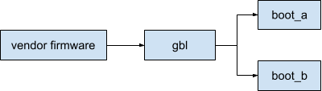
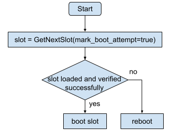
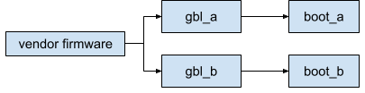
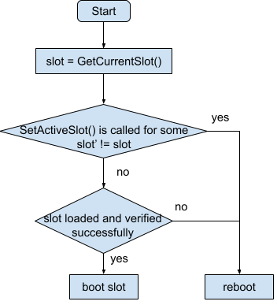

# A/B Boot Flow in GBL

This document explains the A/B boot flows implemented by GBL and its
interaction with EFI protocol
[GBL_EFI_AB_SLOT_PROTOCOL](./gbl_efi_ab_slot_protocol.md).

| **Status**  | Work in progress |
|:------------|-----------------:|
| **Created** |        2024-12-3 |

## Android

For Android, GBL supports the following two configurations of A/B boot:

1. Slotless bootloader + A/B Android.
1. A/B bootloader + A/B Android.

At run time, GBL detects the configuration by checking the return value of
[GBL_EFI_AB_SLOT_PROTOCOL.GetCurrentSlot()](./gbl_efi_ab_slot_protocol.md#gbl_efi_ab_slot_protocolgetcurrentslot).
If the return is error `EFI_UNSUPPORTED`, GBL considers bootloader to be
slotless and proceeds with the
[Slotless bootloader + A/B Android](#slotless-bootloader--ab-android) boot
flow. Otherwise it proceeds with the
[A/B/ bootloader + A/B Android](#ab-bootloader--ab-android) boot flow.

Note: The boot flow supports >2 slots. We use A/B simply as an example for
illustration.

### Slotless Bootloader + A/B Android

#### Platform Setup

This configuration corresponds to the following platform setup.

Device has a single slot GBL bootloader and A/B slot Android OS. Vendor
firmware hands off to the single GBL slot which then make A/B decision for
Android OS.

#### Boot Flow

The boot flow is summarized in the following diagram

GBL will make exactly one call to
[GBL_EFI_AB_SLOT_PROTOCOL.GetNextSlot()](./gbl_efi_ab_slot_protocol.md)
with boolean argument `mark_boot_attempt` set to true for getting the target
slot to boot. When Vendor UEFI firmware sees `mark_boot_attempt=true`, it
should update slot metadata such as derementing retry counter. If the slot is
loaded and verified successfully, GBL proceeds to boot the slot. Otherwise it
triggers a reboot.

### A/B Bootloader + A/B Android

#### Platform Setup

This configuration corresponds to the following platform setup.

Device has A/B GBL bootloader and A/B Android OS. Vendor firmware makes A/B
slot decision and boots to the correponding GBL slot. GBL simply continues to
boot the same Android OS slot.

#### Boot Flow

The boot flow is summarized in the following diagram.

GBL queries the current bootloader slot by calling
[GBL_EFI_AB_SLOT_PROTOCOL.GetCurrentSlot()](./gbl_efi_ab_slot_protocol.md#gbl_efi_ab_slot_protocolgetcurrentslot).
It also tracks whether
[GBL_EFI_AB_SLOT_PROTOCOL.SetActiveSlot()](./gbl_efi_ab_slot_protocol.md#gbl_efi_ab_slot_protocolsetactiveslot)
has been called to change the next active slot to a different slot, i.e. by
`fastboot set_active`. If it has, GBL considers that the user intends to boot
to a different slot than the current one and will trigger a reboot. If not, GBL
proceeds to load and verify the same slot Android OS. If all operations are
successful, GBL boots from it. Otherwise it triggers a reboot. Note that in
this flow, vendor firmware is responsible for updating slot metadata such as
decrementing retry counters before booting GBL.
